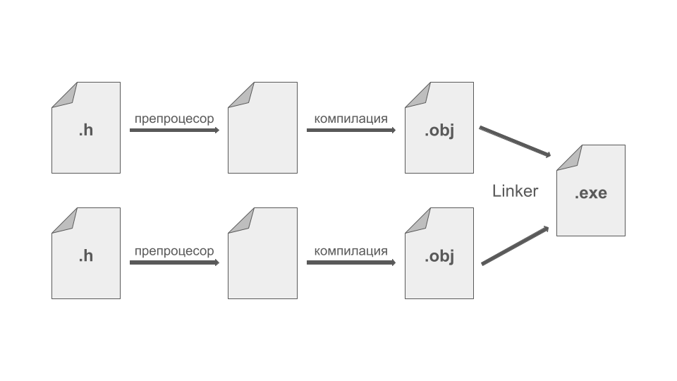

<h1 align="center">ООП - Практикум - 19.03.2025 - Седмица 05</h1>

## Разделна компилация



### Стъпки на компилация

#### 1) Препроцесорни директиви и токенизация

```c++
#include < content >
```

- Съдържанието на `< content >` се замества директно в текущия файл

#### Макроси

```c++
#define SIZE 1024
#define powerOfTwo(x) (1 << x)
#define TT template<typename T>
```

- Навсякъде, където се извиква макросът, се замества със своята дефиниция (текстообработка)

#### Inline

```c++
inline size_t getFileSize(std::ifstream& ifs)
{
	size_t currentPos = ifs.tellg();
	ifs.seekg(0, std::ios::end);
	size_t size = ifs.tellg();
	ifs.seekg(currentPos);

	return size;
}
```

- Подобно на макросите
- Оптимизация
- Не се включват в стековата рамка

#### 2) Синтактичен анализ

- Проверка за коректността в синтаксиса на кода

```c++
int x = 0;
x++; // OK
x+++; // не е ОК
```

#### 3) Семантичен анализ

- Проверка дали обектите и типовете се използват по предназначение

```c++
Apple apple;
apple++; // недефинирано или неочаквано поведение
```

#### 4) Междинна оптимизация

#### 5) Assembly Code

#### 6) Machine Code

#### 7) Linking

#### 8) CPU-Dependent Optimization

При компилация, компилаторът първо преминава през декларациите на функциите, след това през техните дефиниции. Това ни позволява да разцепваме кода си на **.h** и **.cpp** файлове, като по този начин се възползваме максимално от разделната компилация. При промяна в дефиницията на някой от методите, се прекомпилира само **.cpp** файлът, в който имаме промени

Във всеки **header** файл най-отгоре задължително се поставят header guards `# pragma once`, като по този начин се предотвратява някой файл да бъде **include**-нат повече от един път, понеже се вдига флаг, който забранява това нещо

```c++
#pragma once
```

```c++
#ifndef HEADER_FILE_NAME_H
#define HEADER_FILE_NAME_H

// ...

#endif // HEADER_FILE_NAME_H
```

## Копиращ конструктор

- Член-функция, която за параметър приема обект от същия клас **(const reference)**, като текущият става негово копие **(текущият не е съществувал)**

```c++
struct X
{
	int n;
	char ch;
	Y y;
	Z z;

	X(const X& other) : n(other.n), ch(other.ch), y(other.y), z(other.z) {} // К.К Y(), К.К Z()
};
```

- При извикване на конструктори, ако не се укаже експлицитно кой да се извика, се извиква **default**-ния

## Оператор=

- Член-функция, която за параметър приема обект от същия клас **(const reference)**, като текущият става негово копие и текущият е съществувал

```c++
struct X
{
	int n;
	char ch;
	Y y;
	Z z;

	X& operator=(const X& other)
	{
		if (this != &other)
		{
			y = other.y;
			z = other.z;
		}

		return *this;
	}
};
```

- Разликата между копиращ конструктор и оператор= е, че `К.К` създава нов обект, докато `ОП=` трие и копира
- При **default**-но генерираните `К.К` и `ОП=` от компилатора, ако имаме динамична памет, се прави **shallow copy** на обекта, т.е имаме два различни обекта, които сочат към една и съща външна памет
- Това довежда до 2 проблема:
  - При промяна на данните в единия обект, се променят и при другия;
  - Извиква се 2 пъти деструктор, което води до грешка;

### Извикване на конструктори

```c++
struct A {};

A obj; // A()

A obj2(obj); // К.К A()
A obj3 = obj; // К.К A()

obj2 = obj3; // ОП= A()

A a;
A a;
a = a; // валиден синтаксис, но грешка!
	// пробваме се да копираме вече несъществуващи (невалидни) данни
```

### new vs malloc()

- **new**
  - Заделя памет
  - Извиква конструктор
 
- **malloc()**
  - Заделя памет
  - Не извиква конструктор
 
## Композиция и агрегация

### Композиция

```c++
struct A
{
	B b;
	C c;
};
```

- Жизненият цикъл на **B** и **C** зависи от **A**
- Конструкторът на **A** трябва да укаже кои конструктори на **B** и **C** да се извикат

#### Пример за композиция

```c++
struct X
{
	A a;
	B* b;
	C c;

	X()
	{
		b = new B();
	} // A(), B(), C()
};
```

### Агрегация

```c++
struct A
{
	B* ptr;
	C& ref;
};

A(B* ptr, C* ptr2) : ptr(ptr), ref(*ptr2) {}
```

- **B** и **C** живеят извън рамките на **A**
- **~A()** не извиква деструктори за **B** и **C**

#### Пример за агрегация

```c++
Config config;

App a1;
a1.run(config);

App a2;
a2.run(config);
```

## RVO и NRVO

### RVO (Return Value Optimization)

```c++
A createA()
{
	return A();
}
```

### NRVO (Named Return Value Optimization)

```c++
A createA()
{
	A toReturn;
	// ...
	return toReturn;
}
```

### Извикване

- Компилаторът прави оптимизации, чрез които при извикване на дадена функция за инициализиране на обект, се цели избягване на излишни извиквания на копиращ конструктор върху временни обекти (например върнати по копие от функция)

```c++
A createA()
{
	A toReturn; // A()
	// ...
	return toReturn;
} // ~A()

int main()
{
	{
		A obj = createA(); // не се извиква К.К A()
	} // ~A()

	return 0;
}
```
